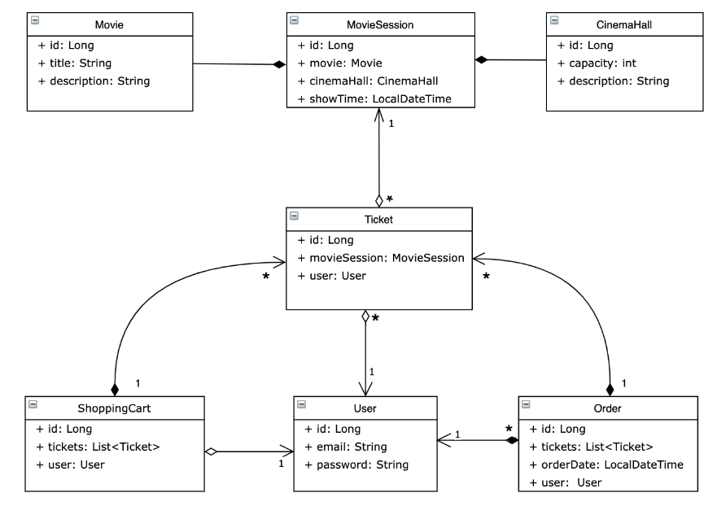

# Cinema app 
## Project description:
```bash
A simple web-application that supports authentication, registration and basic features of the ticket 
reservation service, based on Hibernate and Spring frameworks using REST common principles.
```

## 🎯 Features:
- register and log in as a user/administrator;
#### Registered as USER role:
- find movies and cinema halls
- find available movie sessions
- create shopping cart
- add tickets to shopping cart
- view shopping cart
- make an order
- view order history
#### Registered as ADMIN role:
- create and find movies and cinema halls
- create and find available movie sessions
- find user by email

## 📋 Project structure

The project has a Three-Tier Architecture:
- **Presentation layer** (Controllers) - accepts requests from clients and sends results back to them.
- **Application logic** layer (Service), provide logic to operate on the data sent to and from the DAO and the client.
- **Data access layer** (DAO), represents a bridge between the database and the application.
  

## 🔧 Technical details
- **Entities** represent columns in the database;
- **DTOs** represent communication between Presentation and Service layers;
- **DTO mappers** convert DTOs to entities and vice versa
- **BCryptPasswordEncoder** is used for password encryption
- **Hibernate annotations** are used for field validation
- **Custom annotations** are used for email and password validation
- **Jackson API** is responsible for converting objects to **JSON**
- **Config package** contains classes allow to configure Spring and Hibernate
- **Security package** contains class, allows to create UserDetails which store user information;


## 💻 Steps to run the program on your computer:
1. Clone the repo;
2. Install MySQL;
3. Create new schema in database;
4. Add you DB properties to db.properties file;
5. Configure Apache Tomcat version 9.0.50 **Artifact**: `war-exploded artifact`, **Application context**: `"/"`;
6. Create connection to DB using Database option (Intellij Idea Ultimate).
7. If you haven't Database option, create ConnectionUtil class and connect to DB manually:
   [Connection Util](https://github.com/svitlana-tertyshna/taxi-service/blob/main/src/main/java/taxi/util/ConnectionUtil.java);
8. Done. Now just run it.
9. You can log in both as USER or ADMIN:
```bash
ADMIN: username: admin@i.ua, password: admin123
USER: username: user@i.ua, password: user123
```
10. Use **Postman** to send some http requests;

